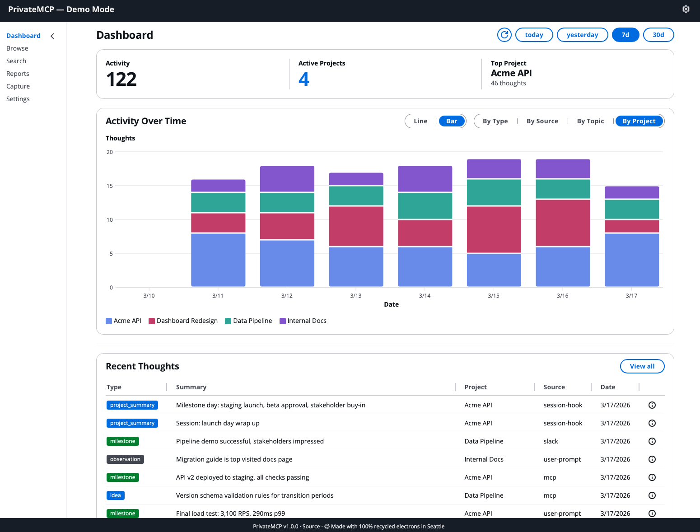
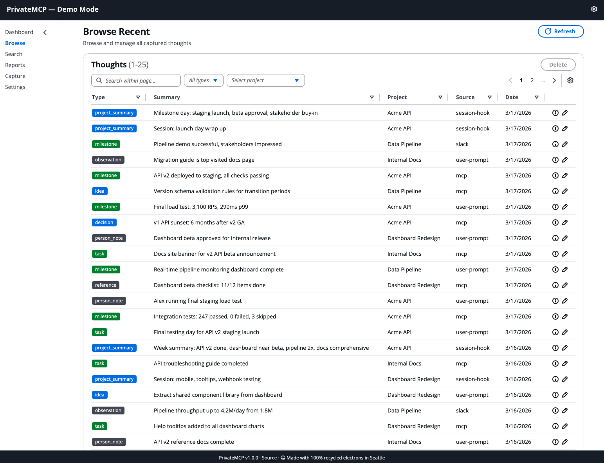
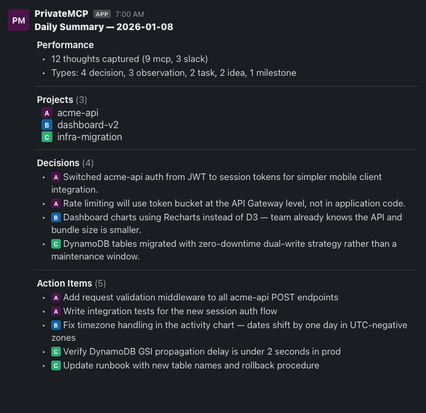

# PrivateMCP

A private MCP server built entirely in your AWS account. Captures, embeds, classifies, and semantically searches your thoughts. No third-party API routing — your data never leaves your AWS account.

## Quick Start

Requires Node.js 22+, AWS CLI v2 with SSO, CDK CLI (`npm install -g aws-cdk`), and [Bedrock model access](https://console.aws.amazon.com/bedrock/home#/modelaccess) enabled for Titan Embeddings v2 and Claude 3 Haiku.

```bash
git clone https://github.com/rusty428/private-mcp.git
cd private-mcp
npm install
cp .env.example .env   # Add your AWS account ID, region, and credentials
npx cdk bootstrap --profile <your-profile>   # First time only
npx cdk deploy PrivateMCPStack --profile <your-profile>
```

After deploy, connect your AI tools using the MCP endpoint from the CDK output. See [DEVELOPER.md](DEVELOPER.md) for full setup including AI tool configuration, web UI deployment, and optional Slack integration.

## Why

Every AI coding session starts from zero. Context from yesterday's debugging session, last week's architecture decision, that pattern you discovered in another project — all gone. You either re-explain it or the AI rediscovers it the hard way.

Private MCP gives your AI tools persistent memory:

- **Decisions survive sessions** — "We chose X over Y because Z" is captured once and searchable forever
- **Sessions have continuity** — Pick up where you left off. Search for what you were working on, not just which files you touched
- **Cross-project awareness** — A solution from project A surfaces when you hit the same problem in project B
- **Relationships, not just documents** — A knowledge graph tracks who works on what, which decisions were made when, and how facts change over time
- **Cross-project discovery** — Find shared topics and people across projects without knowing where to look
- **Automatic capture** — Hook scripts record session summaries and user prompts without manual effort
- **Daily digest** — A Slack summary of yesterday's activity across all projects

Once deployed, the workflow is mostly invisible. Hooks capture automatically. Your AI tools use `capture_thought` as they work. When you need context, `search_thoughts` finds it by meaning — not keywords, not file paths, not commit hashes.

## What It Does

Capture thoughts from any MCP-connected AI tool, the web UI, or Slack — they get embedded, classified, and stored automatically. Any connected tool (Claude Code, Cursor, Claude Desktop) can then search your thoughts by meaning and capture new ones as you work.





## What It Looks Like in Practice

Most of the value comes from what happens automatically. Here's a typical day:

**Starting a session** — You open Claude Code on a project you haven't touched in a week. You ask "what was I working on last time?" Claude calls `search_thoughts`, finds your last session summary and the decisions you made, and picks up where you left off. No scrolling through git logs.

**During work** — You're debugging an auth issue. Claude discovers the root cause and captures: "API Gateway returns 403 when the API key header has a trailing space — the key itself is valid." You don't ask it to. It just does. Meanwhile, the prompt-capture hook is recording your side of the conversation too.

**Hitting a familiar problem** — You run into an S3 Vectors quirk. Claude searches your thoughts and finds a note from three weeks ago in a different project: "S3 Vectors rejects empty arrays in metadata — filter them out before PutVectors." Problem solved in seconds instead of another hour of debugging.

**End of session** — You close Claude Code. The SessionEnd hook fires, captures a summary of what you did, what decisions were made, and what's left to do.

**Next morning** — A Slack message is waiting: yesterday's daily summary across all your projects. Two bugs fixed in project A, a new feature started in project B, and a decision captured in project C about which database to use.



**A week later** — "Why did we use DynamoDB instead of Postgres?" You don't remember which session, which project, or when. Doesn't matter — `search_thoughts` finds the decision by meaning.

**Tracking relationships** — Your AI notices you've assigned Maya to the billing service refactor. It calls `kg_add` to record the relationship: Maya → assigned_to → billing-service. A month later you ask "who owns billing?" — `kg_query` returns Maya instantly, along with when the assignment started and every other fact about the billing service.

**When things change** — Maya finishes the refactor and hands billing to Kai. Your AI calls `kg_invalidate` on Maya's assignment and `kg_add` for Kai's. The old fact isn't deleted — it becomes history. Ask "who was on billing in March?" and you get Maya. Ask "who owns billing now?" and you get Kai. The knowledge graph knows when facts were true, not just that they existed.

**Connecting the dots** — You're starting a new project and wonder which of your existing projects dealt with auth. You ask, and Claude calls `explore_topic("auth")` — it finds auth mentioned across three projects, shows which people were involved in each, and surfaces the most recent activity. Or you ask "what connects PrivateMCP and badgerfy?" and `find_connections` shows the shared topics, shared people, and how much overlap exists. Connections you didn't know were there.

### What captures automatically vs. what you do

| Source | How it works | What it captures |
|---|---|---|
| **Claude Code (MCP)** | Claude calls `capture_thought` on its own when it makes decisions or discovers something worth remembering | Decisions, patterns, solutions, architecture notes |
| **Prompt hooks** | Fires on every message you send | Your questions, instructions, context you provided |
| **Session hooks** | Fires when a session ends | Session summary: what was done, what's next |
| **Slack** | Post to a channel, bot captures it | Quick thoughts, links, ideas you want to remember |
| **Web UI** | Manual capture form | Anything you want to explicitly save |

You don't need to change how you work. Deploy it, connect your tools, and it starts building your knowledge base from day one.

## How It Works

1. **Capture** — Send a thought from any MCP-connected AI tool, the web UI, or Slack. A Lambda generates a vector embedding (Bedrock Titan v2) and extracts metadata (Bedrock Haiku) in parallel, then stores everything in S3 Vectors and DynamoDB. The enrichment pipeline also extracts entity relationships and writes them to the knowledge graph automatically.

2. **Retrieve** — Search your thoughts by meaning, browse recent entries, view stats, or generate narrative reports — from any connected tool or the web dashboard.

3. **Connect** — Query the knowledge graph for entity relationships, explore topics across projects, or discover what bridges two projects through shared people and themes.

## Architecture

```
AI Tools ──MCP──▶ API Gateway ──▶ mcp-server Lambda
                  (x-api-key)           │
                                        ▼
                                  process-thought Lambda
                                    │           │
                                    ▼           ▼
                              Bedrock       Bedrock
                            (Titan Embed)  (Haiku classify)
                                    │           │
                                    └─────┬─────┘
                                          ▼
                                     S3 Vectors

Slack ──webhook──▶ API Gateway ──▶ ingest-thought Lambda ──▶ process-thought
```

## Stack

- **CDK v2** (TypeScript) — all infrastructure as code
- **S3 Vectors** — vector storage with cosine similarity search
- **DynamoDB** — thought metadata, enrichment settings, query indexes
- **Bedrock** — Amazon Titan Embeddings v2 + Claude 3 Haiku
- **API Gateway** — REST API with API key auth
- **Lambda** — Node.js 22, esbuild bundling
- **Web UI** — Vite + React + Cloudscape Design System (dashboard, browse, search, capture, reports, settings)
- **Slack** — optional capture source via webhook

## MCP Tools

| Tool | Description |
|---|---|
| `search_thoughts` | Semantic search — find thoughts by meaning, not keywords |
| `browse_recent` | List recent thoughts, filter by type or topic |
| `stats` | Overview: total count, type breakdown, top topics, date range |
| `capture_thought` | Save a thought from any connected AI tool |
| `daily_summary` | Generate a daily summary of recent activity |
| `kg_query` | Get all relationships for an entity with temporal validity |
| `kg_add` | Add a relationship fact to the knowledge graph |
| `kg_invalidate` | Mark a relationship as no longer true |
| `kg_timeline` | Chronological story of an entity — all facts ordered by time |
| `kg_predicates` | View and manage the relationship vocabulary |
| `find_connections` | Find shared topics and people between two projects |
| `explore_topic` | Explore a topic across projects — which projects and people mention it |
| `explore_person` | Explore a person across projects — which projects and topics they appear in |

## Knowledge Graph

Thoughts capture what happened. The knowledge graph captures what's *true* — and when it stopped being true.

Every entity (person, project, tool, concept) can have typed relationships with temporal validity:

```
Kai  ──works_on──▶  Orion       (since 2025-06, current)
Maya ──assigned_to──▶ auth-migration  (since 2026-01, ended 2026-03)
Team ──decided──▶  use Clerk for auth  (since 2026-01, current)
```

Facts have a lifespan. When Maya finishes the auth migration, that relationship is invalidated — not deleted. Historical queries still find it. Current queries skip it. This is how the system knows the difference between "who *was* working on auth?" and "who *is* working on auth?"

The graph is populated two ways:
- **Automatically** — the enrichment pipeline extracts relationships from captured thoughts during classification
- **Manually** — your AI (or you) can add, query, and invalidate facts directly via MCP tools

**What you can ask:**

| Question | Tool | What it returns |
|----------|------|-----------------|
| "What do we know about Kai?" | `kg_query` | All current and historical relationships involving Kai |
| "Who was on the auth migration in January?" | `kg_query` with `as_of` | Only facts valid on that date |
| "Tell me the story of Project Orion" | `kg_timeline` | Every fact involving Orion, chronologically |
| "Kai moved off Orion" | `kg_invalidate` | Marks the relationship as ended, preserving history |
| "Kai is now on Nova" | `kg_add` | Creates the new relationship with today's date |

## Cross-Project Connections

When you work across multiple projects, patterns emerge: the same topics come up, the same people are involved, the same problems get solved in different ways. Connection discovery surfaces these overlaps automatically from your thought archive.

Three tools, three angles:

**`find_connections`** — What bridges two projects?

```
find_connections("PrivateMCP", "badgerfy")
→ shared_topics: ["auth", "cdk", "lambda"]
  shared_people: ["Kai"]
  project_a: 142 thoughts, 23 topics, 5 people
  project_b: 87 thoughts, 18 topics, 3 people
```

**`explore_topic`** — Where does a topic appear?

```
explore_topic("auth")
→ projects: PrivateMCP (12 mentions), badgerfy (7), claudetrail (3)
  people: Kai, Maya
  related_topics: cdk, lambda, api-gateway
```

**`explore_person`** — What is someone connected to?

```
explore_person("Kai")
→ projects: PrivateMCP, badgerfy
  topics: auth, cdk, deploy, lambda
  recent: 5 most recent thoughts mentioning Kai
```

No configuration needed. These tools aggregate the `topics[]` and `people[]` metadata that the enrichment pipeline already extracts from every thought. The connections are emergent — they exist because the data exists.

## Privacy

- All data stays in your AWS account — no external services, no telemetry, no phone-home
- The hook scripts capture session summaries and user prompts automatically — review them before installing to understand what's recorded
- Thought content is sent to [Amazon Bedrock](https://aws.amazon.com/bedrock/) for embedding and classification — review [Bedrock's data privacy policy](https://docs.aws.amazon.com/bedrock/latest/userguide/data-protection.html) for how your data is handled
- This is a single-tenant system — no data is shared between users

## Cost

All services run on pay-per-use pricing. At ~20 thoughts/day, expect < $1/month.

## Docs

- [DEVELOPER.md](DEVELOPER.md) — Setup, deployment, and configuration
- [ARCHITECTURE.md](ARCHITECTURE.md) — Detailed architecture and design decisions
